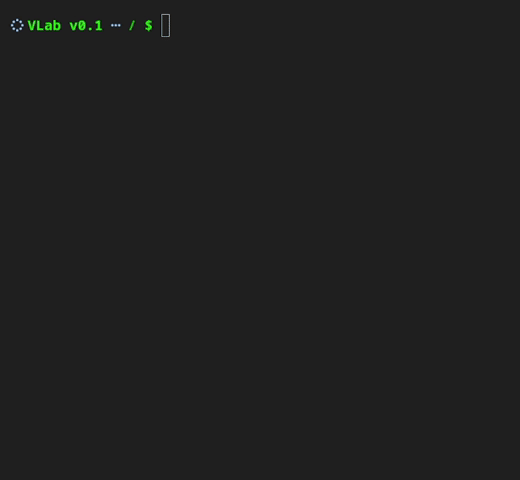
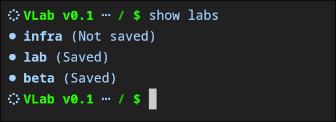
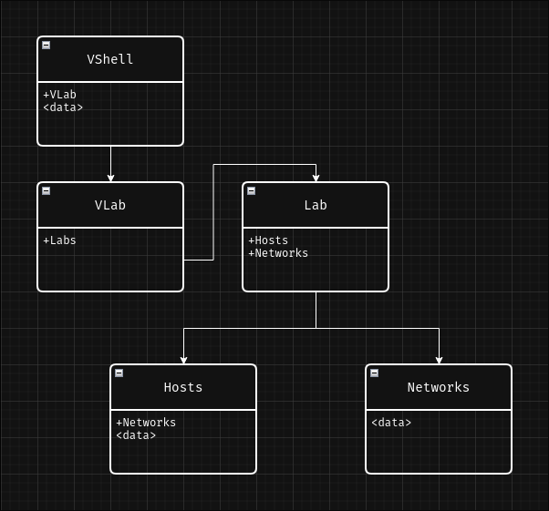

# VLab
> Virtual environment simulating networking infrastructures locally. Built with Docker. <br>
> Made by student, for students. <br>
> Version: v0.1 (beta)

<p align="left">
  <br>
  
  <br>
</p>

## Presentation
VLab is an **educational software** made for **first to second year students** wishing to learn `Networking`, `Cybersecurity` or `DevOps`. <br> <br>

Everything is built around `Labs`. <br>
A lab is a **virtual environment** where you can create virtual `Hosts` and `Networks`, and **connect them together**. <br>
Of course, the `Labs` you create **can be saved**. The saving system works using `JSON files`, you simply type the command `save` and your `Lab` gets written as `JSON text`. <br> <br>

A real use case of this software is a teacher creating a `Lab` with a **server, a firewall, a reverse proxy**.. and then save the `Lab` an **send the config** as `JSON text` to it's students. <br>
That way, students can **easily load the config** using the `JSON text`, and work on the `Lab` **directly on their machine**. <br> <br>

> [!IMPORTANT]
> VLab completely removes the need of native Virtual machines.
<br>

## Installation
```yaml
git clone https://github.com/zelttrox/vlab
```
and then
```yaml
make install
```
> [!CAUTION]
> This is a temporary install method
### Dependencies
- Node.js
- Docker
<br>

## Usage
```yaml
sudo npx tsx vlab.ts
```
> [!CAUTION]
> This is a temporary run method
<br>

## Saving system
The saving system allows the **export and import** of `Labs` as `JSON text`.
<p align="left">
  <br>
  
  <br>
</p>

### Commands
Save your current lab (you have to be inside it)
```yaml
save
```
Load a lab save
```yaml
load <lab>
```

### Save format
Save example
```json
{
    "name": "lab",
    "hosts": [
        {
            "name": "srv",
            "image": "ubuntu",
            "shell": "/bin/bash",
            "networks": [],
            "ports": [],
            "status": "down",
            "ipv4": "10.10.0.1",
            "docker": {
                "modem": {
                    "headers": {},
                    "sshOptions": {},
                    "protocol": "http",
                    "socketPathCache": {}
                },
                "id": "30727962c77aa4967a3dc117a9923efa77b7b3973dfb366e9f2860796c7cf1e9",
            }
        }
    ],
    "networks": []
}
```
<br>

## Objects structure
This is the **objects structure** of `VLab`.
<p align="left">
  <br>
  
  <br>
</p>

`Labs` are inside `VLab`, and `Hosts` and `Networks` are inside `Labs`. <br>
Meaning you **cannot** create a `Lab` inside another `Lab`, and you **cannot** create `Hosts` or `Networks` outside of a `Lab`.
<br>

## File structure
```yaml
v-lab/
├── data/                     # Labs save as .json
├── node_modules/             # Node modules
├── preview/                  # Images used in this readme
├── src/
│   ├── beta/                 # Code for beta features only
│   ├── core/
│   │   ├── commands.ts       # Commands interpreter logic
│   │   ├── handlers.ts       # Handlers linked to commands
│   │   ├── interactive.ts    # Interactive cli prompting
│   │   └── save.ts           # Saving and loading system
│   ├── docker/
│   │   └── client.ts         # Dockerode client to manage docker
│   ├── models/
│   │   ├── host.ts           # Host model object
│   │   ├── lab.ts            # Lab model object
│   │   ├── network.ts        # Network model object
│   │   ├── vlab.ts           # VLab model object
│   │   └── vshell.ts         # VShell model object
│   └── utils/
│       ├── default.ts        # Set default values for hosts and networks
│       ├── verify.ts         # Verify text validity using regex
│       └── visuals.ts        # CLI messages and visuals
├── .gitignore
├── Makefile
├── package.json
├── package-lock.json
├── readme.md
├── tsconfig.json
└── vlab.ts
```
<br>

## Documentation

### Labs

Create new lab

```bash
create lab <name>
```

Delete lab

```bash
delete lab <name>
```

Show available labs

```bash
show labs
```

Enter lab

```bash
shell lab <name>
```

Exit lab

```bash
/
go back
```

Exit vlab

```bash
exit
```

</aside>

---

<aside>

### Hosts

Create new host

```bash
create host <name>
```

See available hosts

```bash
show hosts
```

Check infos of host

```bash
check host <name>
```

Delete host

```bash
delete host <name>
```

Connect host to network

```bash
connect <host> <network>
```

Start host

```bash
start <host>
```

Enter host

```bash
shell host <name>
```

</aside>

---

<aside>

### Networks

Create new network

```bash
create network <name>
```

Show available networks

```bash
show networks
```

Check infos of network

```bash
check network <name>
```

Delete network

```bash
delete network <name>
```
